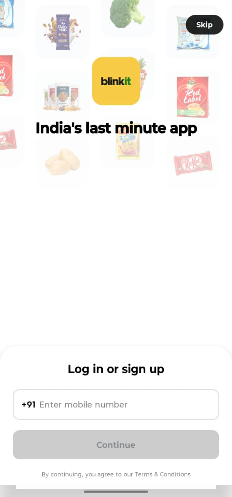
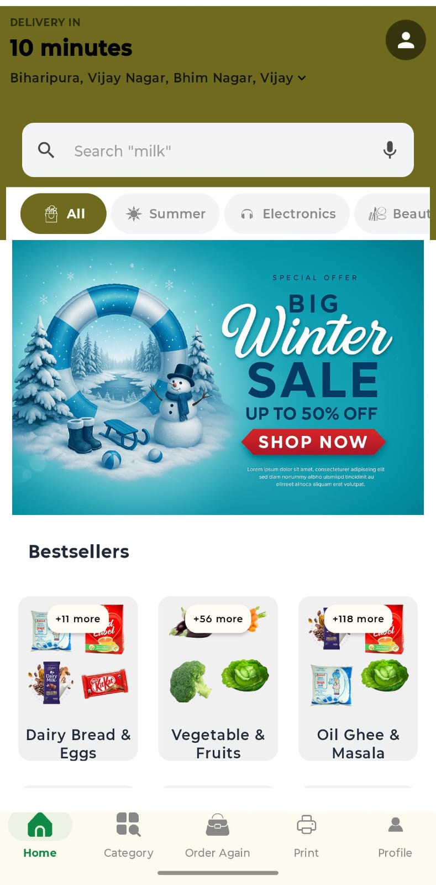
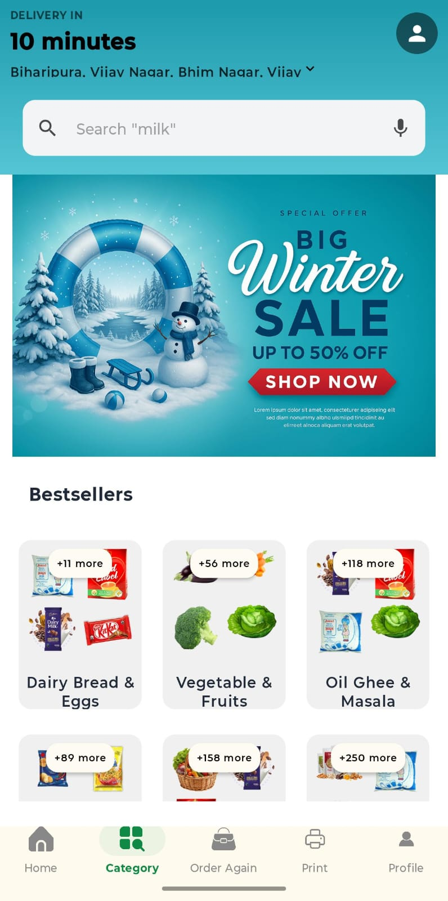
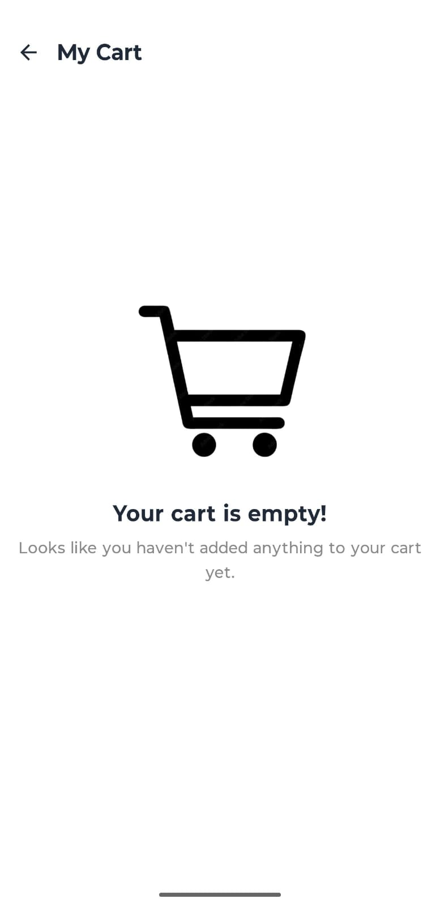
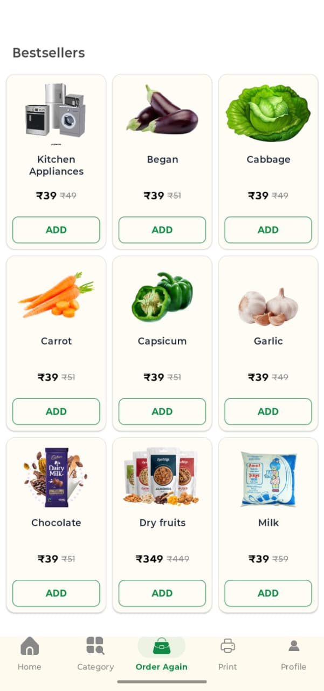
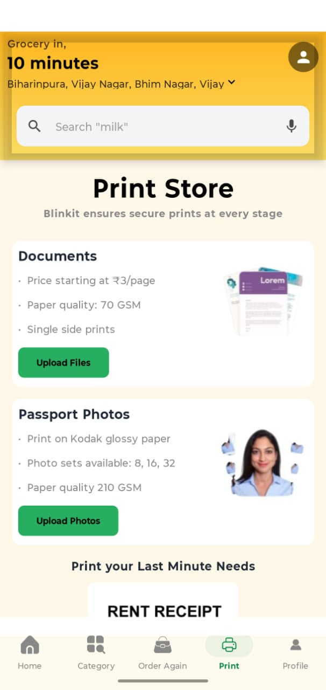
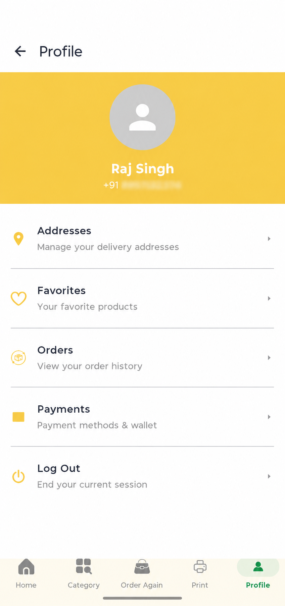
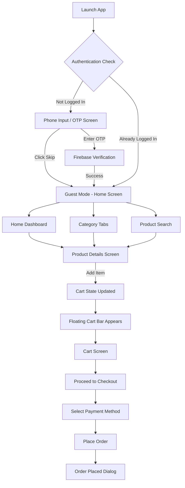
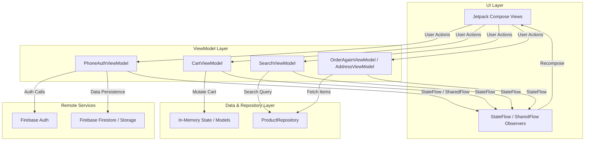

# Blinkit Clone

A modern, high-performance quick-commerce Android application inspired by Blinkit, built natively with **Kotlin**, **Jetpack Compose**, **Material 3**, **Hilt**, and **Firebase Authentication**.

The application delivers a lightning-fast 10-minute grocery and instant-delivery shopping experience—featuring multi-category browsing, real-time debounced product search, interactive cart management, dynamic checkout flows, and print store services.

---

## Overview

This **Blinkit Clone** replicates the core user experience of modern quick-commerce platforms. It connects users with instant grocery delivery through an intuitive, reactive user interface engineered for sub-16ms frame rates and zero-jank transitions.

### Key Highlights
- **Instant Quick-Commerce UI**: 10-minute delivery focus with dynamic category tabs, banners, and bestseller grids.
- **Reactive Architecture**: Powered by Kotlin Coroutines, StateFlow, SharedFlow, and ViewModel architecture.
- **Firebase Authentication**: Secure phone number OTP verification with seamless guest "Skip" mode.
- **Performance Engineering**: Optimizations including `@Immutable` model classes, `drawable-nodpi` asset management, Coil image downsampling, and visibility-culled auto-scrolling carousels.

---

## Features

### 📱 Authentication & Onboarding
- **Firebase Phone Authentication**: OTP verification flow using `FirebaseAuth` and `PhoneAuthProvider` with automatic credential handling.
- **Guest Browsing ("Skip" Mode)**: Allows users to bypass authentication and explore the full app catalog as a guest.
- **One-Shot Sign-Out Event**: Clean session cleanup emitting `SharedFlow` events to safely redirect users to the authentication screen.

### 🛍️ Home & Multi-Category Browsing
- **Dynamic Category Tabs**: Animated tab row (`BlinkItTabRow`) allowing seamless switching between categories:
  - **All**: Bestseller grids, winter offers, grocery, snacks, personal care, and household essentials.
  - **Summer**: Hydration essentials, coolers, soft drinks, and ice creams.
  - **Electronics**: Mobiles, laptops, audio gear, smart watches, chargers, and accessories.
  - **Beauty**: Skin care, hair care, cosmetics, fragrances, and personal grooming.
  - **Kids**: Toys, games, baby care, diapers, and school supplies.
- **Top Delivery Header**: Displays real-time 10-minute delivery time estimates and delivery location details.

### 🔍 Product Search
- **Debounced Real-Time Search**: Search bar (`SearchViewModel`) with a 300ms debounce flow (`searchText.debounce(300L)`) to prevent UI freezes during typing.
- **Search Suggestions**: Pre-populated recent search chips (*Milk*, *Bread*, *Eggs*, *Fruits*) and popular search suggestions (*Maggie*, *Dairy Products*, *Snacks*, *Tea*, *Chocolate*).

### 📦 Product Details
- **Detailed Item View**: High-resolution image view, MRP vs. discounted pricing, discount percentage tags, and delivery time indicators.
- **Interactive Cart Controls**: Direct quantity modification from the product screen.
- **"People Also Bought"**: Contextual product recommendations in a 2-column grid.

### 🛒 Shopping Cart & Dynamic Floating Action Bar
- **Reactive State Management**: Global `CartViewModel` tracking item quantities, subtotal, and grand total in real-time.
- **Floating Cart Button**: Context-aware floating bar appearing whenever `totalItems > 0` across all screens, showing live item count, total price, and a "View Cart" shortcut.
- **Full Cart View**: Detailed item breakdown with `QuantitySelector` controls, bill details breakdown (Item Total + ₹15.00 Delivery Charge), and empty cart fallback view.

### 💳 Checkout & Order Simulation
- **Checkout Summary**: Order summary review with delivery address and billing details.
- **Payment Method Selection**: Interactive selection between Cash on Delivery (COD), UPI, Credit/Debit Cards, and Net Banking.
- **Order Placement**: `OrderPlacedDialog` dialog confirming successful order creation.

### 👤 Profile, Orders & Account Management
- **User Profile Hub**: Direct navigation to saved addresses, order history, payment methods, wishlist/favorites, and account sign-out.
- **Saved Delivery Addresses**: `AddressScreen` for managing saved locations.
- **Favorites / Wishlist**: `FavoritesScreen` for saved products with one-tap add-to-cart functionality.
- **Order Again & History**: `OrderAgainScreen` displaying previously ordered bestsellers for rapid re-ordering.
- **Print Store Services**: `PrintScreen` offering document printing (starting at ₹3/page), passport photo sets, and rent receipt printing with doorstep delivery options.

---

## 📱 App Screenshots

<table align="center">
  <tr>
    <td align="center" width="33%"><b>Login & Authentication</b></td>
    <td align="center" width="33%"><b>Home Dashboard</b></td>
    <td align="center" width="33%"><b>Multi-Category Store</b></td>
  </tr>
  <tr>
    <td align="center"></td>
    <td align="center"></td>
    <td align="center"></td>
  </tr>
  <tr>
    <td align="center" width="33%"><b>Shopping Cart & Checkout</b></td>
    <td align="center" width="33%"><b>Order Again & Bestsellers</b></td>
    <td align="center" width="33%"><b>Print Store Services</b></td>
  </tr>
  <tr>
    <td align="center"></td>
    <td align="center"></td>
    <td align="center"></td>
  </tr>
  <tr>
    <td align="center" width="33%"><b>User Profile & Account</b></td>
    <td align="center" width="33%"></td>
    <td align="center" width="33%"></td>
  </tr>
  <tr>
    <td align="center"></td>
    <td align="center"></td>
    <td align="center"></td>
  </tr>
</table>

---

## User Flow



---

## Technical Architecture

The application follows the recommended **MVVM (Model-View-ViewModel)** pattern with a unidirectional data flow and clean separation of concerns:



### Key Architectural Patterns
- **Unidirectional Data Flow (UDF)**: UI elements observe `StateFlow` streams exposed by ViewModels and emit actions through explicit ViewModel functions.
- **Dependency Injection**: Powered by **Hilt** (`@HiltAndroidApp`, `@HiltViewModel`, `@Inject`) for loose coupling and lifecycle-aware ViewModel injection.
- **Rendering Performance**: Heavy models annotated with `@Immutable` to enable Jetpack Compose smart recomposition skipping.
- **Deferred Image Loading**: Images deferred via `canLoadImages` signals to eliminate frame drop during screen transitions.

---

## Tech Stack

| Category | Technology / Library | Version | Purpose |
| :--- | :--- | :--- | :--- |
| **Language** | [Kotlin](https://kotlinlang.org/) | `2.0.0` | Primary development language |
| **Build Tool** | [Gradle (AGP)](https://developer.android.com/studio/build) | `8.6.0` | Build system (Compile & Target SDK 35, Min SDK 25) |
| **UI Framework** | [Jetpack Compose](https://developer.android.com/compose) | BOM `2024.04.01` | Declarative UI framework |
| **Design System** | [Material 3](https://developer.android.com/jetpack/compose/designsystems/material3) | Compose Material 3 | Modern UI components and theming |
| **Dependency Injection** | [Hilt](https://dagger.dev/hilt/) | `2.50` | Compile-time dependency injection |
| **Image Loading** | [Coil](https://coil-kt.github.io/coil/) | `2.6.0` | Asynchronous image loading and caching |
| **Authentication** | [Firebase Auth](https://firebase.google.com/docs/auth) | BOM `32.7.0` | Phone number OTP verification |
| **Cloud Services** | [Firebase Firestore / Storage](https://firebase.google.com/) | BOM `32.7.0` | Cloud backend SDKs |
| **Async & Streams** | [Kotlin Coroutines & Flows](https://kotlinlang.org/docs/coroutines-overview.html) | `1.7.3` | Reactive asynchronous programming |
| **Navigation** | [Navigation Compose](https://developer.android.com/jetpack/compose/navigation) | AndroidX | Type-safe composable screen navigation |
| **Animations** | [Lottie Compose](https://github.com/airbnb/lottie-android) | `4.2.0` | Vector animation rendering |
| **System UI** | [Accompanist SystemUIController](https://google.github.io/accompanist/systemuicontroller/) | `0.31.1-alpha` | Edge-to-edge status bar configuration |

---

## Project Structure

```text
Blinkit_Clone/
├── app/
│   ├── build.gradle.kts
│   ├── proguard-rules.pro
│   └── src/
│       ├── main/
│       │   ├── AndroidManifest.xml
│       │   ├── java/com/example/blinkit_clone/
│       │   │   ├── BaseApplication.kt              # Hilt Application class & Firebase init
│       │   │   ├── MainActivity.kt                 # Entry Activity setting Compose content
│       │   │   ├── Common/
│       │   │   │   └── AuthState.kt                # Sealed class for auth state transitions
│       │   │   ├── Profile/
│       │   │   │   ├── AddressScreen.kt            # Saved address management screen
│       │   │   │   ├── AddressViewModel.kt         # Address state holder
│       │   │   │   ├── FavoritesScreen.kt          # Favorites / Wishlist screen
│       │   │   │   ├── FavoritesViewModel.kt       # Favorites state holder
│       │   │   │   ├── OrdersScreen.kt             # Order history list
│       │   │   │   └── PaymentsScreen.kt           # Saved payment options screen
│       │   │   ├── Screens/
│       │   │   │   ├── BeautyScreen.kt             # Beauty category view
│       │   │   │   ├── ElectronicsScreen.kt        # Electronics category view
│       │   │   │   └── KidsScreen.kt               # Kids category view
│       │   │   ├── Utills/
│       │   │   │   ├── CartViewModel.kt            # Global shopping cart state holder
│       │   │   │   ├── OrderAgainViewModel.kt      # Frequently ordered items ViewModel
│       │   │   │   ├── SearchViewModel.kt          # Debounced search ViewModel
│       │   │   │   └── VerticalTabViewModel.kt     # Vertical category ViewModel
│       │   │   ├── data/
│       │   │   │   ├── BlinkitCategoryData.kt      # Category data model
│       │   │   │   └── ProductRepository.kt        # Master product catalog & search logic
│       │   │   ├── domain/
│       │   │   │   └── ProductItem.kt              # @Immutable Product domain model
│       │   │   ├── presentation/screens/
│       │   │   │   ├── auth/
│       │   │   │   │   └── PhoneAuthViewModel.kt   # Phone Auth & Sign Out ViewModel
│       │   │   │   └── CategoryScreen/
│       │   │   │       ├── AllCategoryScreen.kt    # Default category screen
│       │   │   │       ├── AppNavigation.kt        # Root NavHost & Auth redirect logic
│       │   │   │       ├── BestSellerComponent.kt  # Bestseller grid component
│       │   │   │       ├── BlinkitProfileScreen.kt # Profile & account screen
│       │   │   │       ├── CartScreen.kt           # Full Cart view & checkout CTA
│       │   │   │       ├── CategoryScreen.kt       # Multi-category parent screen
│       │   │   │       ├── FinalCheckoutScreen.kt  # Payment & checkout screen
│       │   │   │       ├── HomeScreen.kt           # Dashboard & category tab container
│       │   │   │       ├── MainScreen.kt           # Bottom bar & Scaffold container
│       │   │   │       ├── OrderAgainScreen.kt     # Bestsellers & re-order grid
│       │   │   │       ├── PhoneAuthScreen.kt      # OTP & Phone auth parent view
│       │   │   │       ├── PhoneNumberInputScreen.kt # Phone number entry & Skip button
│       │   │   │       ├── PrintScreen.kt          # Print store services
│       │   │   │       ├── ProductCard.kt          # Reusable product item card
│       │   │   │       ├── ProductScreen.kt        # Dedicated product detail screen
│       │   │   │       ├── Routes.kt               # Navigation routes sealed class
│       │   │   │       ├── SearchBarScreen.kt      # Real-time search screen
│       │   │   │       └── SummerCategoryScreen.kt # Summer category view
│       │   │   └── ui/theme/                       # Theme, Colors, Typography
│       │   └── res/
│       │       ├── drawable/                       # Icons, shapes, drawables
│       │       ├── drawable-nodpi/                 # High-res banners & assets (no-scale)
│       │       ├── mipmap-*/                       # Application launcher icons
│       │       └── values/                         # Colors, strings, themes XML
├── build.gradle.kts                                # Root build configuration
├── settings.gradle.kts                             # Module & repository settings
└── gradle/
    └── libs.versions.toml                          # Version catalog dependencies
```

---

## Setup & Installation

### Prerequisites
- **Android Studio**: Ladybug (2024.2.1) or newer recommended.
- **JDK**: Java Development Kit 17 (configured in Android Studio).
- **Android SDK**: SDK Level 35 installed (Minimum SDK: 25).
- **Physical Device / Emulator**: Running Android 7.1.1 (API 25) or higher.

### Step-by-step Setup Instructions

1. **Clone the Repository**:
   ```bash
   git clone https://github.com/rajsingh/Blinkit_Clone.git
   cd Blinkit_Clone
   ```

2. **Open in Android Studio**:
   - Open Android Studio and choose **Open an Existing Project**.
   - Select the `Blinkit_Clone` root directory.
   - Wait for Gradle to sync dependencies automatically.

3. **Firebase Setup**:
   - Create a project on the [Firebase Console](https://console.firebase.google.com/).
   - Add an Android App with the package name: `com.example.blinkit_clone`.
   - Enable **Phone Authentication** in the Firebase Console under **Authentication -> Sign-in method**.
   - Download the generated `google-services.json` file.
   - Place `google-services.json` inside the `app/` directory (`app/google-services.json`).

4. **Build the Project**:
   ```bash
   ./gradlew assembleDebug
   ```

5. **Run the Application**:
   - Connect an Android device or launch an emulator.
   - Click **Run 'app'** in Android Studio or run via CLI:
     ```bash
     ./gradlew installDebug
     ```

---

## Configuration & Security

- **Secrets Isolation**: `google-services.json` and local build properties are excluded from version control via `.gitignore` to prevent leaking Firebase app secrets or API credentials.
- **No Hardcoded Keys**: All API configurations and Google Services IDs are injected at build time through Gradle plugins and Firebase initialization.

---

## Build & Testing

### Gradle Commands

| Task | Command | Description |
| :--- | :--- | :--- |
| **Build Debug APK** | `./gradlew assembleDebug` | Compiles debug APK (`app/build/outputs/apk/debug/`) |
| **Build Release APK** | `./gradlew assembleRelease` | Compiles release APK |
| **Run Unit Tests** | `./gradlew testDebugUnitTest` | Executes local JVM unit tests |
| **Run Android Tests** | `./gradlew connectedAndroidTest` | Runs instrumented UI tests on connected device |

---

## Limitations

- **In-Memory Shopping Cart**: Cart items and address selections are managed in-memory via ViewModels (`CartViewModel`, `AddressViewModel`). Cart state resets when the application process is terminated.
- **Mock Product Repository**: Product listings, categories, and prices are served locally via `ProductRepository` for instant offline browsing.
- **Simulated Order Placement**: Placing an order shows `OrderPlacedDialog` and clears the cart, but does not initiate real online payment gateway API calls.

---

## Future Improvements

- [ ] **Room Database Integration**: Offline persistent cart, saved addresses, and order history caching.
- [ ] **REST API Integration**: Connect to a live Ktor/Node.js backend for dynamic inventory management.
- [ ] **Real Payment Gateway Integration**: Razorpay / Stripe integration for live transactions.
- [ ] **Real-Time Order Tracking**: Live GPS delivery tracking map interface.

---

## Contributors

- **Raj Singh** ([@rajsingh](https://github.com/rajsingh)) - Lead Developer & Author (`rajsingh8957132374@gmail.com`)
